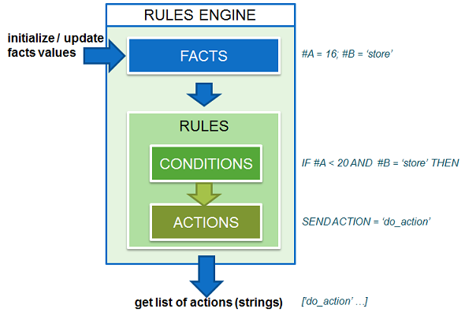

# Introduction to cloj-rules-engine

**cloj-rules-engine** is a very simple rules engine written in [Clojure](https://clojure.org/) and designed to work with Java.



**Features**:

- Each **rule** has a **condition** (composed of conditional expressions -written in Clojure- that refer to facts), and a set of **actions** that are activated if the condition is satisfied. **Facts** are the data upon which rules operate. The fired actions are a represented as a set of identifiers (strings).

- Rules are expressed in a simple and easy to read Clojure format ([clojure *maps*](http://www.deadcoderising.com/2015-04-clojure-basics-dealing-wit-maps/))

```clojure
{
  :RULE_1 {:cond "(and (< #A 10) (> #B 50))"
           :actions ["action-1"]}
  ...
}
```

- Facts can be expressed via clojure maps (Clojure) or via PersistentArrayMap objects (Java):

```clojure
(update-map-facts {"#A" "14"})
```

```java
PersistentArrayMap facts_map = new PersistentArrayMap(new Object[] {
		"#A", "14"
	});
clrules.updateMapFacts(facts_map);
```

- This library can be used from Java or Clojure code

- Third party libraries used in this project:

| Libs                      | Version       | License                                   |
| ------------------------- |:-------------:| -----------------------------------------:|
| [clojure](https://clojure.org/) | 1.8.0 | [](https://opensource.org/licenses/EPL-1.0) |
| [tools.logging](https://github.com/clojure/tools.logging)  | 0.3.1   | [](https://opensource.org/licenses/EPL-1.0) |
| [log4j](http://logging.apache.org/log4j/1.2/)  | 1.2.17  | [](https://opensource.org/licenses/Apache-2.0) |
| [data.json](https://github.com/clojure/data.json)   | 0.2.6   | [](https://opensource.org/licenses/EPL-1.0) |
| [proto-repl](https://github.com/jasongilman/proto-repl) | 0.3.1   | [](https://opensource.org/licenses/MIT) |
| [math.numeric-tower](https://github.com/clojure/math.numeric-tower/) | 0.0.4 | [](https://opensource.org/licenses/EPL-1.0) |

- Main methods:
  - **initialize** loads rules map from absolute or relative path. Returns *true* if everything is okay.

  ```clojure
  (initialize "rules.clj")
  ```

  ```java
  clrules.initialize("rules.clj");
  ```

  - **update-map-facts** update / initialize facts

  ```clojure
  (update-map-facts {"#A" "14"})
  ```

  ```java
  clrules.updateMapFacts(facts_map);
  ```

  - **get-rules-actions** evaluates rules based on current facts, and return a list (String) of 'fired' actions

  ```clojure
  (get-rules-actions)
  ```

  ```java
  clrules.getRulesActions();
  ```

  - **get-fired-rules**

  - **initialize-from-json**
